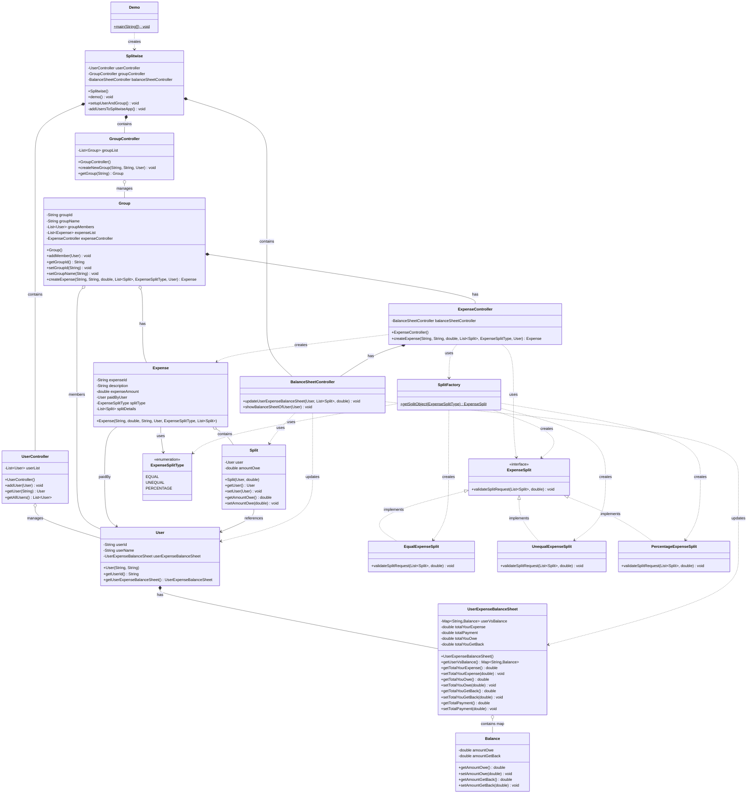
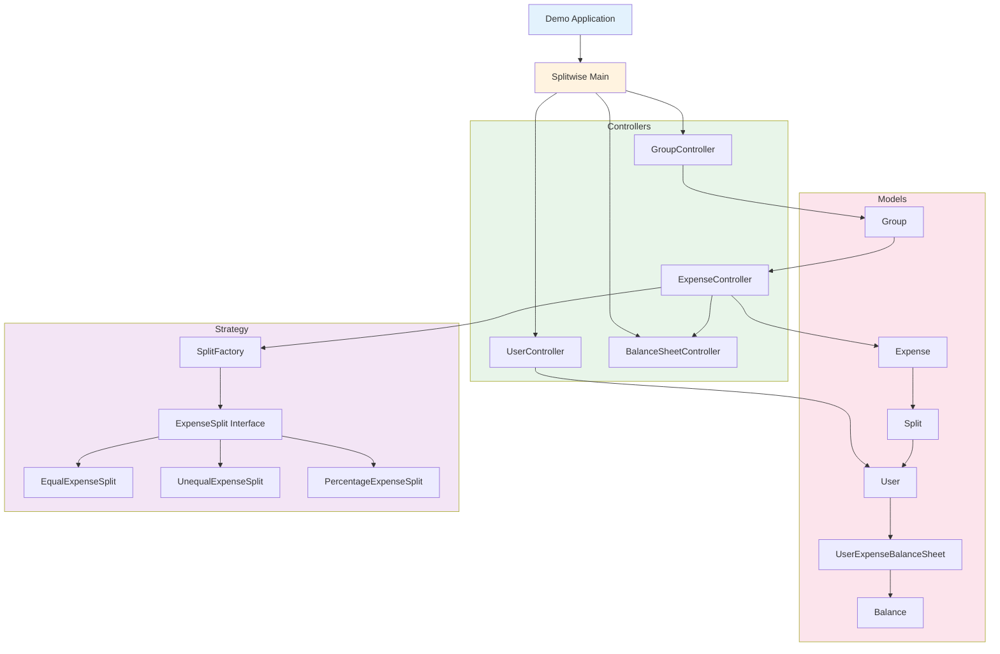
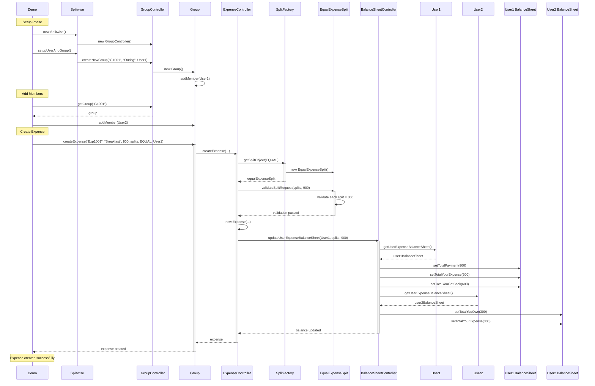
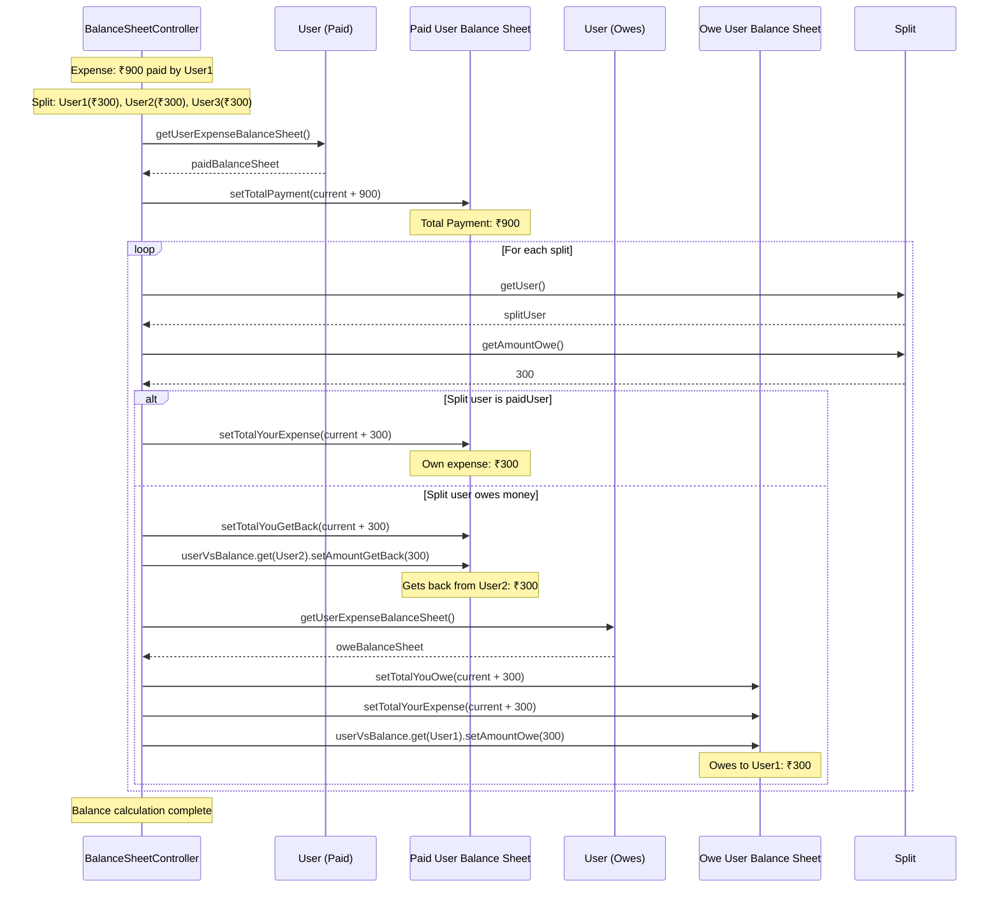

# Splitwise Expense Sharing System - Design Documentation

## Requirements

### Functional Requirements
1. **User Management**: Add and manage users in the system
2. **Group Creation**: Create groups and add members
3. **Expense Creation**: Create expenses with different split types (Equal, Unequal, Percentage)
4. **Balance Tracking**: Track who owes whom and how much
5. **Balance Sheet**: View detailed balance sheet for each user
6. **Expense Validation**: Validate split amounts match total expense
7. **Multiple Split Types**: Support equal, unequal, and percentage-based splits

### Non-Functional Requirements
1. **Scalability**: Support multiple users and groups
2. **Accuracy**: Precise balance calculations
3. **Extensibility**: Easy to add new split types
4. **Maintainability**: Clean separation of concerns
5. **Flexibility**: Support various expense sharing scenarios

## Objectives

### Primary Objectives
1. **Implement Strategy Pattern**: Handle different expense split types
2. **Implement Factory Pattern**: Create split strategy objects
3. **Balance Management**: Accurately track all debts and credits
4. **Group Expense Tracking**: Manage expenses within groups
5. **User-Centric Design**: Maintain per-user balance sheets

### Design Objectives
1. Create a flexible expense sharing system
2. Minimize coupling between components
3. Follow SOLID principles
4. Use appropriate design patterns for extensibility

## Design Patterns Used

### 1. Strategy Pattern (Implemented)
**Purpose**: Define a family of algorithms (split types), encapsulate each one, and make them interchangeable.

**Implementation**:
- **Strategy Interface**: `ExpenseSplit` defines validation contract
- **Concrete Strategies**:
  - `EqualExpenseSplit`: Splits expense equally among all users
  - `UnequalExpenseSplit`: Splits expense in custom amounts
  - `PercentageExpenseSplit`: Splits expense by percentage

**Benefits**:
- Easy to add new split types (e.g., ratio-based, custom algorithms)
- Each split strategy is independently testable
- Client code doesn't need to know split logic details
- Open/Closed Principle: Add new strategies without modifying existing code

### 2. Factory Pattern (Implemented)
**Purpose**: Create objects without specifying exact class

**Implementation**:
- **Factory**: `SplitFactory` creates appropriate split strategy based on type
- **Product**: `ExpenseSplit` interface

**How it works**:
```java
ExpenseSplit expenseSplit = SplitFactory.getSplitObject(ExpenseSplitType.EQUAL);
expenseSplit.validateSplitRequest(splitDetails, expenseAmount);
```

**Benefits**:
- Centralized object creation
- Easy to add new split types
- Decouples client from concrete classes

### 3. Controller Pattern (Implemented)
**Purpose**: Separate business logic from data models

**Implementation**:
- `UserController`: Manages user operations
- `GroupController`: Manages group operations
- `ExpenseController`: Manages expense creation and validation
- `BalanceSheetController`: Manages balance calculations

**Benefits**:
- Clear separation of concerns
- Centralized business logic
- Easy to test and maintain

## UML Class Diagram



## System Architecture Diagram



## Sequence Diagram - Creating an Expense



## Sequence Diagram - Balance Calculation Logic



## Class Responsibilities

### Core Application Classes

#### Splitwise
- **Purpose**: Main application orchestrator
- **Responsibilities**:
  - Initialize all controllers
  - Setup users and groups
  - Demonstrate application flow
  - Coordinate between different components

#### Demo
- **Purpose**: Application entry point
- **Responsibilities**:
  - Start the application
  - Invoke demo scenarios

### User Management

#### User
- **Purpose**: Represent a user in the system
- **Responsibilities**:
  - Store user ID and name
  - Maintain personal balance sheet
  - Provide access to balance information

#### UserController
- **Purpose**: Manage all users
- **Responsibilities**:
  - Add new users to system
  - Retrieve users by ID
  - Maintain list of all users

### Balance Tracking

#### UserExpenseBalanceSheet
- **Purpose**: Track all financial transactions for a user
- **Responsibilities**:
  - Track total expense amount
  - Track total payment made
  - Track total amount owed to others
  - Track total amount to get back
  - Maintain user-wise balance map

#### Balance
- **Purpose**: Represent balance between two users
- **Responsibilities**:
  - Track amount one user owes another
  - Track amount one user should get back from another

#### BalanceSheetController
- **Purpose**: Manage balance calculations and updates
- **Responsibilities**:
  - Update balance sheets when expenses are created
  - Calculate who owes whom
  - Display balance sheets
  - Handle complex balance logic

### Group Management

#### Group
- **Purpose**: Represent a group of users sharing expenses
- **Responsibilities**:
  - Store group ID and name
  - Maintain list of members
  - Maintain list of expenses
  - Create new expenses within group

#### GroupController
- **Purpose**: Manage all groups
- **Responsibilities**:
  - Create new groups
  - Retrieve groups by ID
  - Maintain list of all groups

### Expense Management

#### Expense
- **Purpose**: Represent a single expense
- **Responsibilities**:
  - Store expense details (ID, description, amount)
  - Store who paid for the expense
  - Store split type and split details
  - Link to involved users

#### ExpenseController
- **Purpose**: Manage expense creation and validation
- **Responsibilities**:
  - Create new expenses
  - Validate split amounts
  - Coordinate with balance sheet controller
  - Use factory to get split strategy

#### Split
- **Purpose**: Represent one user's share in an expense
- **Responsibilities**:
  - Link user to their owed amount
  - Store amount user owes for the expense

### Strategy Pattern Components

#### ExpenseSplit (Strategy Interface)
- **Purpose**: Define contract for split validation
- **Responsibilities**:
  - Declare validation method
  - Allow different split algorithms

#### EqualExpenseSplit
- **Purpose**: Validate equal split
- **Responsibilities**:
  - Verify each person's share is equal
  - Verify total matches expense amount
- **Validation**: `amount per person = total / number of people`

#### UnequalExpenseSplit
- **Purpose**: Validate unequal split
- **Responsibilities**:
  - Verify custom split amounts
  - Verify total of all splits matches expense amount

#### PercentageExpenseSplit
- **Purpose**: Validate percentage-based split
- **Responsibilities**:
  - Verify percentages add up to 100%
  - Calculate actual amounts from percentages

### Factory Pattern Components

#### SplitFactory
- **Purpose**: Create appropriate split strategy
- **Responsibilities**:
  - Return correct strategy based on split type
  - Centralize strategy instantiation
- **Method**: `getSplitObject(ExpenseSplitType) : ExpenseSplit`

#### ExpenseSplitType (Enum)
- **Purpose**: Define available split types
- **Values**: EQUAL, UNEQUAL, PERCENTAGE

## Balance Calculation Examples

### Example 1: Equal Split - Breakfast (₹900)
**Scenario**: User1 pays ₹900 for breakfast, split equally among 3 people

**Initial State**:
```
User1: Balance = 0
User2: Balance = 0
User3: Balance = 0
```

**Splits**:
```
User1: ₹300 (own share)
User2: ₹300 (owes to User1)
User3: ₹300 (owes to User1)
```

**User1 Final State**:
```
Total Payment: ₹900
Total Your Expense: ₹300
Total You Get Back: ₹600
User2 owes you: ₹300
User3 owes you: ₹300
```

**User2 Final State**:
```
Total Payment: ₹0
Total Your Expense: ₹300
Total You Owe: ₹300
You owe User1: ₹300
```

**User3 Final State**:
```
Total Payment: ₹0
Total Your Expense: ₹300
Total You Owe: ₹300
You owe User1: ₹300
```

### Example 2: Unequal Split - Lunch (₹500)
**Scenario**: User2 pays ₹500 for lunch, unequal split

**Splits**:
```
User1: ₹400 (owes to User2)
User2: ₹100 (own share)
```

**User1 State After Lunch**:
```
Total Payment: ₹900 (from breakfast)
Total Your Expense: ₹700 (₹300 breakfast + ₹400 lunch)
Total You Get Back: ₹600 (from breakfast)
Total You Owe: ₹400 (to User2)
User2 owes you: ₹300 (breakfast)
You owe User2: ₹400 (lunch)
Net with User2: You owe ₹100
```

**User2 State After Lunch**:
```
Total Payment: ₹500
Total Your Expense: ₹400 (₹300 breakfast + ₹100 lunch)
Total You Owe: ₹300 (to User1 from breakfast)
Total You Get Back: ₹400 (from User1 for lunch)
You owe User1: ₹300 (breakfast)
User1 owes you: ₹400 (lunch)
Net with User1: You get back ₹100
```

## Relationship Types

| From | To | Relationship | Type | Description |
|------|-----|--------------|------|-------------|
| ExpenseSplit | EqualExpenseSplit, UnequalExpenseSplit, PercentageExpenseSplit | Implementation | implements | Strategy implementations |
| SplitFactory | ExpenseSplit | Creation | creates | Factory creates strategies |
| Splitwise | UserController, GroupController, BalanceSheetController | Composition | contains | Splitwise owns controllers |
| User | UserExpenseBalanceSheet | Composition | has | User has balance sheet |
| UserExpenseBalanceSheet | Balance | Aggregation | contains | Map of balances |
| Group | User | Aggregation | members | Group has members |
| Group | Expense | Aggregation | has | Group has expenses |
| Expense | Split | Aggregation | contains | Expense has splits |
| Split | User | Association | references | Split links to user |
| ExpenseController | BalanceSheetController | Composition | has | Controller has balance controller |
| ExpenseController | SplitFactory | Dependency | uses | Uses factory |

## Key Design Insights

### Strengths
1. **Strategy Pattern**: Easy to add new split types
2. **Factory Pattern**: Centralized strategy creation
3. **Controller Separation**: Clear separation of concerns
4. **Balance Tracking**: Comprehensive balance management
5. **Group Support**: Multi-user expense sharing
6. **Flexible Splits**: Supports multiple split types

### Current Implementation
1. **Three Split Types**: Equal, Unequal, Percentage
2. **User-Centric**: Balance calculated per user
3. **Group-Based**: Expenses within groups
4. **Real-Time Updates**: Balances updated immediately
5. **Bidirectional Tracking**: Tracks both debts and credits

### Limitations
1. **No Persistence**: Data lost when application ends
2. **No Settlement**: No feature to settle debts
3. **No Simplification**: Doesn't simplify complex debts (A owes B, B owes C → A owes C)
4. **No Currency**: Assumes single currency
5. **No Categories**: No expense categorization
6. **No Time Tracking**: No timestamps for expenses
7. **Limited Validation**: Basic validation only

### Potential Enhancements

#### 1. Debt Simplification Algorithm
```java
public class DebtSimplifier {
    public List<Transaction> simplifyDebts(List<User> users) {
        // Calculate net balance for each user
        Map<User, Double> netBalance = calculateNetBalance(users);
        
        // Use greedy algorithm to minimize transactions
        List<Transaction> simplified = new ArrayList<>();
        // Algorithm to reduce number of transactions
        return simplified;
    }
}
```

#### 2. Settlement Feature
```java
public class Settlement {
    private User from;
    private User to;
    private double amount;
    private Date settlementDate;
    
    public void settleDebt(User from, User to, double amount) {
        // Mark debt as settled
        // Update balance sheets
        // Record settlement history
    }
}
```

#### 3. Expense Categories
```java
public enum ExpenseCategory {
    FOOD, TRANSPORTATION, ACCOMMODATION, 
    ENTERTAINMENT, UTILITIES, OTHERS
}

public class Expense {
    private ExpenseCategory category;
    private Date expenseDate;
    private String location;
    // ... other fields
}
```

#### 4. Currency Support
```java
public class Money {
    private double amount;
    private Currency currency;
    
    public Money convertTo(Currency targetCurrency) {
        // Use exchange rate API
        return new Money(convertedAmount, targetCurrency);
    }
}
```

#### 5. Recurring Expenses
```java
public class RecurringExpense extends Expense {
    private RecurrencePattern pattern; // DAILY, WEEKLY, MONTHLY
    private Date startDate;
    private Date endDate;
    
    public List<Expense> generateExpenses() {
        // Generate expenses based on pattern
        return expenses;
    }
}
```

#### 6. Notification System (Observer Pattern)
```java
interface ExpenseObserver {
    void onExpenseCreated(Expense expense);
    void onExpenseModified(Expense expense);
}

class EmailNotifier implements ExpenseObserver {
    public void onExpenseCreated(Expense expense) {
        // Send email notification
    }
}

class PushNotifier implements ExpenseObserver {
    public void onExpenseCreated(Expense expense) {
        // Send push notification
    }
}
```

#### 7. Expense History and Analytics
```java
public class ExpenseAnalytics {
    public double getTotalExpenseByCategory(User user, ExpenseCategory category);
    public double getMonthlySpending(User user, Month month);
    public Map<ExpenseCategory, Double> getCategoryWiseBreakdown(Group group);
    public List<Expense> getExpenseHistory(User user, Date from, Date to);
}
```

## Testing Scenarios

### Scenario 1: Equal Split Among 3 Users
```
Expense: ₹900 (Breakfast)
Paid by: User1
Split Type: EQUAL
Participants: User1, User2, User3

Expected:
- Each person's share: ₹300
- User1 paid: ₹900, owes: ₹0, gets back: ₹600
- User2 paid: ₹0, owes: ₹300, gets back: ₹0
- User3 paid: ₹0, owes: ₹300, gets back: ₹0
```

### Scenario 2: Unequal Split Between 2 Users
```
Expense: ₹500 (Lunch)
Paid by: User2
Split Type: UNEQUAL
Splits: User1(₹400), User2(₹100)

Expected:
- User1 owes User2: ₹400
- User2 paid: ₹500, owes: ₹0, gets back: ₹400
```

### Scenario 3: Multiple Expenses with Net Settlement
```
Expense 1: User1 pays ₹300 for User1(₹150) + User2(₹150)
Expense 2: User2 pays ₹200 for User1(₹100) + User2(₹100)

Expected Net:
- User1 owes User2: ₹150 - ₹100 = ₹50
```

## Real-World Applications

### Similar Systems
1. **Splitwise**: Actual expense sharing app
2. **Venmo**: Payment and expense splitting
3. **PayPal**: Group payments
4. **Google Pay**: Bill splitting
5. **Tricount**: Travel expense sharing

### Use Cases
1. **Roommate Expenses**: Rent, utilities, groceries
2. **Travel Groups**: Hotels, meals, activities
3. **Office Lunches**: Team meal expenses
4. **Events**: Party or event cost sharing
5. **Projects**: Shared project expenses

## Conclusion

This Splitwise system demonstrates effective use of multiple design patterns:
- **Strategy Pattern** for handling different split types
- **Factory Pattern** for creating split strategies
- **Controller Pattern** for separating concerns

The architecture is clean, extensible, and ready for enhancements like debt simplification, settlement features, expense categories, and notification systems.
